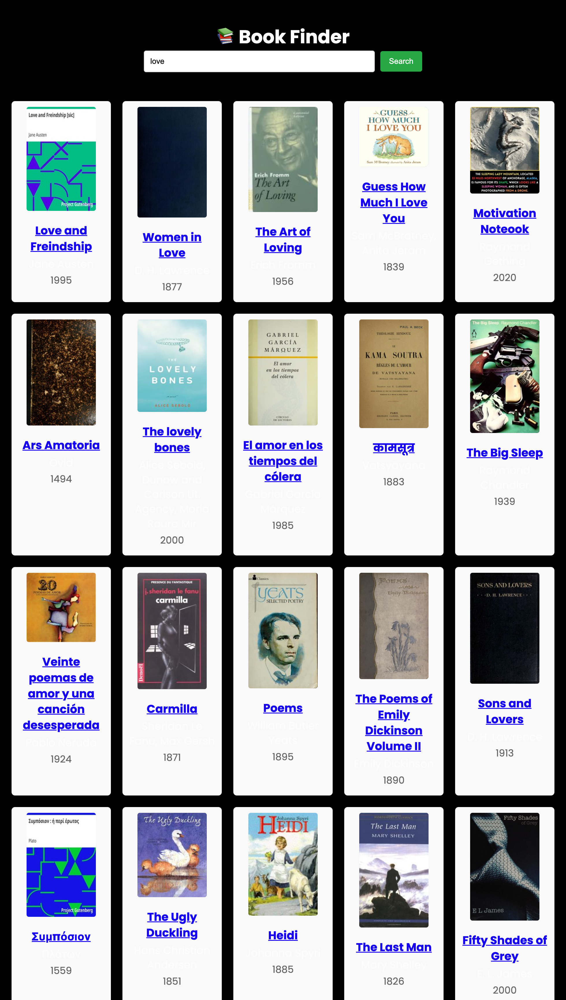

 # Book Finder App

A simple web app that allows you to search for books using the [Open Library API](https://openlibrary.org/developers/api).  
You can search any keyword, see book covers, authors, and publication years, and click through to the Open Library page to learn more or get the book.

---

## Features
- Search for books by title, author, or keyword  
- Displays cover image, title, author(s), and first published year  
- Clickable links to the Open Library page for each book  
- "Load More" button to view additional results  
- Responsive grid layout for clean book display  
- Lightweight — just **HTML, CSS, and JavaScript**  

---

## Technologies Used
- HTML5  
- CSS3  
- Vanilla JavaScript (ES6+)  
- Open Library Books API  

---

## Project Structure
book-finder-app/
│── index.html # Main HTML file
│── style.css # Styles for the app
│── script.js # JavaScript logic (search, render, load more)
│── README.md # Project documentation

## API Reference
We’re using the Open Library Search API:
https://openlibrary.org/search.json?q=SEARCH_TERM

## Covers are fetched from:
https://covers.openlibrary.org/b/id/COVER_ID-M.jpg

## More docs: 
<a href="https://openlibrary.org/developers/api">Open Library API</a>

## Preview

